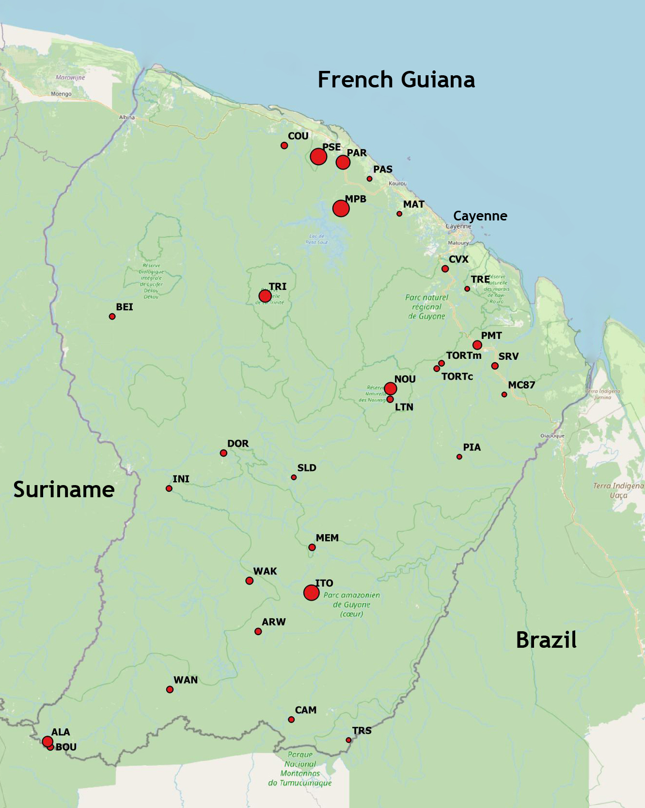

```{r DoNotModify, include=FALSE}
### Utilities. Do not modify.
# Installation of packages if necessary
InstallPackages <- function(Packages) {
  InstallPackage <- function(Package) {
    if (!Package %in% installed.packages()[, 1]) {
      install.packages(Package, repos="https://cran.rstudio.com/")
    }
  }
  invisible(sapply(Packages, InstallPackage))
}

# Basic packages
InstallPackages(c("bookdown", "formatR", "kableExtra", "ragg"))

# kableExtra must be loaded 
if (knitr::opts_knit$get("rmarkdown.pandoc.to") == "docx") {
  # Word output (https://stackoverflow.com/questions/35144130/in-knitr-how-can-i-test-for-if-the-output-will-be-pdf-or-word)
  # Do not use autoformat (https://github.com/haozhu233/kableExtra/issues/308)
  options(kableExtra.auto_format = FALSE)
}
library("kableExtra")

# Chunk font size hook: allows size='small' or any valid Latex font size in chunk options
def.chunk.hook  <- knitr::knit_hooks$get("chunk")
knitr::knit_hooks$set(chunk = function(x, options) {
  x <- def.chunk.hook(x, options)
  ifelse(options$size != "normalsize", paste0("\n \\", options$size,"\n\n", x, "\n\n \\normalsize"), x)
})
```

```{r Options, include=FALSE}
### Customized options for this document
# Add necessary packages here
Packages <- c("ade4", "broom", "dbmss", "entropart", "nleqslv", "secret", "tidyverse", "SPECIES")
# Install them
InstallPackages(Packages)

# knitr options
knitr::opts_chunk$set(
  cache=TRUE, # Cache chunk results
  echo=FALSE, # Show/Hide R chunks
  include=FALSE, # Show/Hide R chunks and result
  warning=FALSE, # Show/Hide warnings
  message=FALSE, # Show/Hide messages
  # Figure alignment and size
  fig.align='center', out.width='80%',
  # Graphic devices (ragg_png is better than standard png)
  dev = c("ragg_png", "pdf"),
  # Code chunk format
  tidy=TRUE, tidy.opts=list(blank=FALSE, width.cutoff=50),
  size="scriptsize", knitr.graphics.auto_pdf=TRUE
  )
options(width=50)

# ggplot style
library("tidyverse")
theme_set(theme_bw())
theme_update(panel.background=element_rect(fill="transparent", colour=NA),
             plot.background=element_rect(fill="transparent", colour=NA))
knitr::opts_chunk$set(dev.args=list(bg="transparent"))

# Random seed
set.seed(973)
```

# Introduction

Biodiversity assessment in tropical moist forests is a practical challenge but a major goal considering they are the most diverse terrestrial ecosystems.
Estimating the number of tree species is made possible by the long-term effort of sampling resulting in thousands of forest plots organized in various networks. 
In French Guiana, the GuyaDiv network consists of close to 250 plots across the whole forest.
Based on similar datasets, the diversity of tree species has been estimated in Amazonia [@TerSteege2013; @TerSteege2020] and at the world scale [@Slik2015] and, with a different methodology, by @CazzollaGatti2022.
Regional diversity, i.e. at a intermediate scales between single communities and the metacommunity in the sense of @Hubbell2001, brought less attention: this motivated this study, along with a particular interest for the forest of French Guiana.

The main contribution of this paper is to estimate the number of tree species at the regional scale, in French Guiana (8 million hectares of tropical moist forest with no ecological boundary to distinguish them from the rest of Amazonia) and demonstrate which method is valid to do so.
We build on Harte's self-similarity model [@Harte1999] that implies the power-law relationship of @Arrhenius1921 and provides a technique to evaluate its parameters [@Harte1999a], previously applied by @Krishnamani2004 in the Western Ghats, India, a 60,000-ha tropical forest with around 1,000 tree species.

We also compare this method to several alternatives: nonparametric estimators including the grid-aggregated occurrence-based estimation by @CazzollaGatti2022, log-series extrapolation [@TerSteege2013] and the universal species-area relationship based on maximum entropy [@Harte2009].
We discuss in depth which method may be applied according to the addressed spatial scale.


# Methods

```{r vault}
library("tidyverse")
# Decrypt the vault
library("secret")
name_project <- "GF-Richness"
vault <- "vault"
Sys.setenv(USER_KEY = usethis::proj_path(paste0(name_project, ".rsa")))
```

## Data

To apply the methods detailed below, a large enough inventory is necessary along with a set of small, widely spread forest plots.
We gathered 3 local, large inventories to account for environmental variability and a network of plot covering the whole region.

```{r GuyaDiv}
# Plots: code, location, X, Y
Plots <- get_secret("Plots", vault = vault)
# Abundances of species in each plot
Abundances <- get_secret("Abundances", vault = vault)
# Eliminate undetermined species
cf <- grepl("cf.", colnames(Abundances))
Abundances <- Abundances[, !cf]
# Number of plots
guyadiv_plots <- nrow(Plots)
# Number of locations
guyadiv_locations <- length(unique(Plots$Location))
```

Our plot network is GuyaDiv [@Engel2015].
Since the installation of the first plots in 1986, the GuyaDiv network has continuously grown until today. 
It now consists of 243 plots of various sizes and shapes, distributed in various forest types, in 30 sites across French Guiana (figure \@ref(fig:GuyaDivMap)). 
We took into account the `r guyadiv_plots` one-hectare plots of the network. 
They are located in `r guyadiv_locations` sites, which provides fairly good coverage of the variability of the forest in French Guiana.

(ref:GuyaDivMap) The GuyaDiv network of tropical forest plots. All trees above 10 cm DBH are localized, measured and determined botanically at species level. Each red point represents a location where several forest plots were established. The size of the points corresponds to the total area of theirs plots. Paracou, Piste de Saint-Elie and Nouragues are denoted PAR, PSE and NOU.
```{r GuyaDivMap, fig.cap="(ref:GuyaDivMap)", include=TRUE}

```


```{r Paracou, eval=FALSE}
# Extrapolation of species with confidence >=2 in the database
# All plots
paracou_area <- (15 * 6.25 + 25) / 100
paracou_envelope <- 3.5
# From Paracou database
# Abundances of species in each plot
Paracou_abd <- get_secret("Paracou_abd", vault = vault)
# Extrapolate richness to the envelope area
library("entropart")
paracou_S <- round(Diversity(Paracou_abd, q = 0, 
                Level = round(paracou_envelope / paracou_area*sum(Paracou_abd))))
```

```{r b}
# Number of species and envelope area
paracou_S <- 571 + 575 - 443 + 37
paracou_envelope <- 4.84
PSE_S <- 763
PSE_envelope <- 3
NOU_S <- 850
NOU_envelope <- 2.5
```

The Paracou research station [@Gourlet-Fleury2004] contains six 6.25-ha and one 25-ha plots of primary rainforest.
Nine 6.25-ha plots were logged between 1986 and 1988 in a forestry experiment that temporarily increased the recruitment of light-demanding species [@Mirabel2021] and the functional diversity [@Mirabel2020].

In a rather conservative approach, we retained only the well-identified trees of the permanent plots (571 species) and added available data from the GuyaDiv network: transects from @Molino2001 and ten 0.49-ha plots around the Guyaflux tower [@Bonal2008] contain 575 species, including 132 new ones.
37 more species at the French Guiana IRD Herbarium [CAY: @Gonzalez2022] were collected in the area but outside the plots.
The total number of species is thus `r paracou_S` included in a `r paracou_envelope`-km^2^ convex envelope.

The Piste de Saint-Elie site has been intensively sampled for 50 years.
It encompasses nineteen 1-ha and one half-hectare plots in GuyaDiv and a few small plots added for various studies.
Moreover, many herbarium specimen were collected from the site.
As a whole, we gathered `r PSE_S` species in a `r PSE_envelope`-km^2^ area.

Nouragues research station [@Bongers2001] provides 22 hectares of permanent plots.
We applied the same protocol, adding 11 Guyadiv plots and herbarium collections up to `r NOU_S` species in a `r NOU_envelope`-km^2^ area.


## Self-similarity

Self-similarity [@Harte1999] is a property based on scale invariance.
Consider a species that is present in an area $A_0$, say French Guiana.
The probability to find it in half the whole area, denoted $A_1$ is $a$.
Then, if it is present $A_1$, the probability to find it in turn in half $A_1$, denoted $A_2$, is also $a$, and so on.
The probability to find the species in $A_n$ is thus $a^n$.
In other words, the conditional probability to find a species in a sub-area, given that it is present in the area containing it, is constant: it does not depend either on the observation scale nor on the species considered.

The Arrhenius power law [@Arrhenius1921] both implies and is a consequence of the self-similarity property [@Harte1999].
The number of species $\mathrm{S}(A)$ observed in an area $A$ is

\begin{equation}
  \mathrm{S}(A)=cA^z
  (\#eq:Arrhenius)
\end{equation}

where $z$ is the power parameter and $c$ is the number of species in an area of size 1.
Actually, $a=2^{-z}$.
This is a classical relation in macroecology, with long empirical and theoretical support [@Williamson2001; @GarciaMartin2006].

If $z$ is known, the inventory of a reasonably large area $b$ allows computing $c=S(b)/b^{z}$.
Then, $\mathrm{S}(A)$ can be calculated for any value of $A$.

@Harte1999a showed that under the assumption of self-similarity, $z$ can be inferred from the dissimilarity between small and distant plots of equal size distributed across the area.
The @Sorensen1948 similarity between two plots is

\begin{equation}
  \chi = 2 (S_1 \cap S_2) / (S_1 + S_2)
  (\#eq:Sorensen)
\end{equation}

where $S_1$ (respectively $S_2$) is the number of species in plot 1 (resp. plot 2) and $S_1 \cap S_2$ is the number of common species.

Applied to plots of the same size separated by distance $d$, Sørensen's similarity decreases with distance following the relation $\chi \sim d^{-2z}$ [@Harte1999a] that can be estimated by the linear model

\begin{equation}
  \log(\chi) \sim \log(d).
  (\#eq:estimatez)
\end{equation}

The logarithm of the Sørensen dissimilarity between pairs of plots can be regressed against the logarithm of the distance between the plots: the slope of the regression is $-2z$.

The relation \@ref(eq:estimatez) holds at the same scale as the power law, i.e. at the regional scale [@Grilli2012].
@Krishnamani2004 estimated $z \approx 0.12$ with a very good fit to the linear model at distances up from 1 km but not below.


```{r n_simulations}
# Number of simulations to run
n_simulations <- 1000L
```

The number of plots varies across locations so the estimation of $z$ must be made with care.
We sampled one random plot at each location to obtain $`r guyadiv_locations` \times `r guyadiv_locations-1`/2 = 210$ pairs of plots.
We calculated the Sørensen dissimilarity $\chi$ and the geographic distance $d$ between each pair of plots.
We estimated $z$ as half the coefficient of the distance variable in the linear model $\log(\chi) \sim \log(d)$.
We repeated these steps `r n_simulations` times to obtain a distribution of estimated $z$ values depending on the plots drawn in each location.
$z$ was estimated as the empirical mean of the distribution and its 95% confidence interval was obtained by eliminating the 2.5% extreme values on both tails.

```{r FrenchGuiana}
# Extrapolation area in squared km
A0 <- 80000
```

The confidence interval of the estimation of the number of species was assessed by combining the uncertainty in $c$ and $A^z$.
The variance of $c$ was estimated by the empirical variance of the values calculated at Paracou, Piste de Saint-Elie and Nouragues. 
That of $A^z$ was obtained from the empirical distribution of $z$.
The variance of their product was calculated (the formula and its derivation are in the appendix).
Finally, we assumed the normality of the distribution of the product of the estimates to retain an approximate 95% confidence interval of $\pm$ 2 standard deviations.

All analyses were made with R [@R] v. 4.3.1.


## Nonparametric estimators

At smaller scales, i.e. inside a single community, the relation between area and number of species is described by species accumulation curves [SAC: @Gotelli2001].
It is driven by statistical models that address incomplete sampling [@Shen2003; @Beguinot2015a].
After replacing the sampled area by the number of individuals it contains, well-known estimators of richness such as Chao's [@Chao1984] or the jackknife [@Burnham1978] apply.

The Chao1 estimator is

\begin{equation}
  {\hat{S}}_{\mathit{Chao1}} = s_{obs} + \frac{(n-1)f_1^2}{2nf_2},
  (\#eq:Chao1)
\end{equation}

where $s_{obs}$ is the number of observed species, $n$ is the sample size, $f_1$ and $f_2$ the number of species observed once and twice.
Since $n$ is large, $(n-1)/2n$ can be approximated by $1/2$.

The jackknife estimator depends on the sampling level of the data.
The estimator of order $k$ includes $f_1, f_2, ..., f_k$, the number of species observed up to $k$ times.
Increasing the order implies increasing both the estimate and its uncertainty: starting from order 1, the order is incremented as long as the new estimator is significantly higher than the previous one [@Burnham1978].
For large $n$, the jackknife estimator of order 3, used below, is

\begin{equation}
  {\hat{S}}_{\mathit{Jack3}} = s_{obs} + 3f_1 - 3f_2 + f_3.
  (\#eq:Jack3)
\end{equation}


An alternative, following @CazzollaGatti2022, consists of paving the territory with a grid whose size does not change the estimation, say 100 km. 
In each 100 by 100 km cell of the grid, all available data is aggregated to obtain an occurrence dataset.
The Chao2 estimator (whose formula is identical to that of Chao1, with $n$ equal to the number of grid cells) is finally applied: it combines the the number of species observed in only one or two cells to estimate the number of unobserved species.

The Chao and Jackknife estimators variance can be estimated and a confidence interval is available [@Chao1987; @Burnham1978].


## Log-series extrapolation

Assuming that the plots are samples of a metacommunity that follows a log-series distribution, the rank-abundance curve can be extrapolated following @TerSteege2013.

First, the total number of trees is estimated by extrapolation of the average number of trees per 1-ha plot of the Guiadiv network to the 8 million hectares of the French Guiana forest.

The probability for one of these trees to belong to a given species is obtained by averaging the frequency of the species among plots.
Each plot is a sample of a local community whose composition is not completely known: many rare species are not in the sample.
The observed frequency of a species in a plot is not the probability of the species in the community: frequencies sum up to 1 while the sum of the actual probabilities of observed species, called the sample coverage [@Good1953], sums up to 1 minus that of the unobserved species.
The actual probabilities of observed species can be estimated following @Chao2015, with the *entropart* package [@Marcon2014c].

The number of trees per species is then obtained by multiplying the total number of trees by the probability of each species.
A rank-abundance curve is produced.
Its center part is a straight line (see figure \@ref(fig:logseries)) that can be extrapolated down to the last species, represented by a single tree.
The number of species is finally counted.

Its confidence interval is not available: the extrapolation of the curve is very robust, but the estimation of the total number of trees and of the probabilities of species are sources of uncertainty.


## Universal species-area relationship 

@Harte2008 derived a universal species-area relationship based on the maximum entropy theory.
Assuming only that the area, the total numbers of species and individuals, and the summed metabolic energy rate of all individuals are fixed, many features of the species distribution at any scale can be predicted.
Of particular interest is the possibility to derive the number of species in a doubled area from the number of species in a sampled, reference area [@Harte2009; @Xu2012].
Starting from a local sample, that may be a single 1-ha plot or one of our large inventories, the area can be doubled until the target size is reached.

The number of trees per hectare is estimated from the Guyadiv network to obtain a single starting point rather than a different one for each plot.
To be consistent with the model, the geometric mean is applied: its logarithm equals the average logarithm of the number of trees in all 1-ha plots.

Each step of the estimation consists of doubling the area and calculating the new number of species.
This operation is repeated until the target area (8 Mha) is reached, i.e. between 15 times for Paracou (the largest inventory: `r paracou_envelope * 100` ha) and 24 times for the 1-ha plots.


# Results

## Self-similarity

```{r estimate_z}
library("ade4")
library("broom")
library("dbmss")
# estimate_z selects one random plot per location,
# estimates log(Sorensen) ~ log(Distance)
# and returns z
estimate_z <- function() {
  # Select one plot per location...
  Plots %>% 
    # Set a random value to each plot
    mutate(Random=runif(n())) -> 
    RandomizedPlots
  RandomizedPlots %>% 
    group_by(Location) %>%
    # Select the plot with the max random value in each location
    summarize(MaxRandom=max(Random)) %>% 
    rename(Random=MaxRandom) %>% 
    # Eliminate non-selected plots
    inner_join(RandomizedPlots) %>% 
    # Suppress messages from GH Action logs
    suppressMessages %>% 
    select(Plot) -> 
    SelectedPlots
  # Calculate distances
  Plots %>% 
    # Selected plots only
    inner_join(SelectedPlots) %>%
    # Suppress messages from GH Action logs
    suppressMessages %>% 
    rename(PointName=Plot, X=X_UTM, Y=Y_UTM, PointType=Location) %>% 
    mutate(PointWeight=1) %>% 
    # Create a weighted, marked planar point pattern (dbmss)
    wmppp(unitname = c("meter", "meters")) %>% 
    suppressWarnings %>% 
    # Calculate distances between pairs of plots
    pairdist() %>% 
    # Make a dist object (ade4)
    as.dist -> 
    Distances
  # Calculate Sorensen divergence
  Abundances %>% 
    # Selected plots only
    inner_join(SelectedPlots) %>% 
    # Suppress messages from GH Action logs
    suppressMessages %>% 
    select(-Plot) %>% 
    # Calculate Sorensen dissimilarity
    dist.binary(method = 5) -> 
    Sorensen
  # Sorensen similarity
  Sorensen <- 1-Sorensen
  # Regress log(Sorensen) ~ log(Distance)
  tibble(Sorensen=as.numeric(log10(Sorensen)), 
         Distance=as.numeric(log10(Distances))) %>% 
    # Distances over 1km
    dplyr::filter(Distance > log10(0.8)) %>% 
    # Estimate the model
    lm(Sorensen~Distance, data=.) %>% 
    # Extract the slope
    tidy %>% 
    dplyr::filter(term == "Distance") %>% 
    select(estimate) %>% 
    pull -> 
    slope
  # z is negative half the slope
  z <- -slope/2
  return(z)
}
```

```{r bootstrap_z}
if (interactive()) {
  # Prepare a progress bar
  pgb <- txtProgressBar(min=0, max=n_simulations)
  # To store bootstrapped z values
  sim_z <- rep(0, n_simulations)
  # Run simulations
  for (i in 1:n_simulations) {
    sim_z[i] <- estimate_z()
    setTxtProgressBar(pgb, i)
  }
} else {
  # Compact code
  sim_z <- replicate(n_simulations, estimate_z())
}

# Statistics
z <- mean(sim_z)
z_sigma <- sd(sim_z)
alpha <- 0.05
z_ci <- quantile(sim_z, probs = c(alpha/2, 1-alpha/2))
# Not retained: standard error of the mean
# z_ci <- qt(1-alpha/2,
#           df=guyadiv_locations*(guyadiv_locations-1)/2 -2) *
#  z_sigma / sqrt(n_simulations)

# Plot the distribution of z
# entropart::as.SimTest(z, sim_z) %>% autoplot
```

The relation between Sørensen's similarity and distance is presented in figure \@ref(fig:slope).
All pairs of plots more than 1 km apart (the scale of Paracou's 0.625-km^2^ inventory) are shown and the regression line of the figure illustrates the relation.
Actually, the estimation of $z$ was made as explained in the methods by `r n_simulations` random draws of sets of a single random plot per location.

(ref:slope) Relation between Sørensen's similarity and the distance between pairs of plots. Both axes are in base-10 logarithms, distances are in meters. Each point is a pair of plots more than 1000 m ($10^3$) apart, up to 377 km. A linear model is fitted: the slope of the regression is $-2z$.
```{r slope, fig.cap="(ref:slope)", include=TRUE}
library("ade4")
library("dbmss")

# Calculate distances between plots
Plots %>% 
  rename(PointName=Plot, X=X_UTM, Y=Y_UTM, PointType=Location) %>% 
  mutate(PointWeight=1) %>% 
  # Create a weighted, marked planar point pattern (dbmss)
  wmppp(unitname = c("meter", "meters")) %>% 
  suppressWarnings %>% 
  # Calculate distances between pairs of plots
  pairdist() %>% 
  # Make a dist object (ade4)
  as.dist -> 
  Distances

# Calculate Sorensen's similarity
Abundances %>% 
  select(-Plot) %>% 
  # Calculate Sorensen dissimilarity
  dist.binary(method = 5) -> 
  Sorensen
# similarity
Sorensen <- 1-Sorensen

# Regress log(Sorensen) ~ log(Distance)
tibble(Sorensen=as.numeric(log10(Sorensen)), 
       Distance=as.numeric(log10(Distances))) %>% 
  # Distances over 1km
  dplyr::filter(Distance > 3) %>% 
  ggplot(aes(x=Distance, y=Sorensen)) +
    geom_point() +
    geom_smooth(method = lm)
```

The estimated value of $z$ is `r z %>% round(3) %>% format(nsmall=3)` with a 95% confidence interval between `r z_ci[1] %>% round(3) %>% format(nsmall=3)` and `r z_ci[2] %>% round(3) %>% format(nsmall=3)`.

```{r estimate_c}
# From 3 sites
c_paracou <- paracou_S / paracou_envelope^z
c_PSE <- PSE_S / PSE_envelope^z
c_NOU <- NOU_S / NOU_envelope^z
c_est <- (c_paracou + c_PSE + c_NOU) / 3
```

The estimated number of species per squared kilometer, $c$, is respectively `r c_paracou %>% round(0)`, `r c_PSE %>% round(0)` and `r c_NOU %>% round(0)` in Paracou, Piste de Saint-Elie and Nouragues.
The average value is `r c_est %>% round(0)`.

```{r estimate_S}
# Estimated number of species
S <- c_est * A0^z
# Confidence interval
var_Az <- var(A0^sim_z)
e_Az <- mean(A0^sim_z)
var_c <- var(c(c_paracou, c_PSE, c_NOU))
var_S <- c_est^2*var_Az + e_Az^2*var_c + var_Az*var_c
sigma_S <- sqrt(var_S)
```

Finally, the estimated number of species is `r S %>% round(0)`.
Taking into account the uncertainty about $c$ and $z$, its 95% confidence interval is between `r (S-2*sigma_S) %>% round(0)` and `r (S+2*sigma_S) %>% round(0)`.

## Species accumulation

```{r jackknife}
library("entropart")
Community <- colSums(Abundances[, -1])
S_best <- Richness(Community)
S_Chao1 <- Richness(Community, Correction="Chao1")
# Confidence interval given by SPECIES
j3 <- SPECIES::jackknife(AbdFreqCount(Community))
```

The observed number of species is `r sum(Community>0)` among which `r sum(Community==1)` and `r sum(Community==2)` are sampled once and twice.
The lower-bound estimation of the number of species by the Chao1 estimator is `r round(S_Chao1)`. 
The best jackknife estimator (of order 3) is `r S_best`.
Its confidence interval is between `r j3$CI[1]` and `r j3$CI[2]` at the 5% risk level.

```{r Chao2, include=FALSE}
# Group plots in a grid
group_plots <- function(Plots, grid_x, grid_y) {
  xy_grid <- matrix(0, nrow=nrow(Plots), ncol=2)
  for (row in seq_len(nrow(Plots))) {
    xy_grid[row, 1] <- grid_x[max(which(Plots$X_UTM[row] > grid_x))]
    xy_grid[row, 2] <- grid_y[max(which(Plots$Y_UTM[row] > grid_y))]
  }
  colnames(xy_grid) <- c("x_grid", "y_grid")
  return(xy_grid)
}

# Estimate total richness according to the size
gridded_richness <- function(Abundances, Plots, grid_size, x_min=0, x_max=1, y_min=0, y_max=1) {

  grid_x <- seq(x_min, x_max, by=grid_size)
  grid_y <- seq(y_min, y_max, by=grid_size)
  gridded_Plots <- cbind(Plots["Plot"], group_plots(Plots, grid_x, grid_y))

  Abundances %>%
    group_by(Plot) %>%
    summarise_all(sum) %>%
    inner_join(gridded_Plots) %>%
    select(-Plot) %>%
    group_by(x_grid, y_grid) %>%
    summarise_all(sum) ->
    Gridded_Plots

  Occurences <- apply(Gridded_Plots[, -(1:2)] , 2, function(x) sum(x>0))
  n <- nrow(Gridded_Plots)
  s_obs <- sum(Occurences > 0)
  s_1 <- sum(Occurences == 1)
  s_2 <- sum(Occurences == 2)
  S_chao2 <- s_obs + (n-1) * s_1^2 / 2 / n / s_2
  # Confidence interval
  attr(S_chao2, "CI") <- SPECIES::chao1984(AbdFreqCount(Community))
  return(S_chao2)
}

# Check that estimation does not vary with grid size
sapply(
  1:8, 
  function(n) 
    gridded_richness(
      Abundances, Plots, 1000 * 2^n, 
      x_min=116000, x_max=374000, y_min=244000, y_max=587000
      )
  )

# Estimation of richness, grid size = 100 km
S_Chao2 <- gridded_richness(
  Abundances, Plots, grid_size=100000, 
  x_min=116000, x_max=374000, y_min=244000, y_max=587000
  )
```

The Chao2 estimator applied to the same plots aggregated into 100 x 100 km cells is `r round(S_Chao2)`.
Its confidence interval is between `r attr(S_Chao2, "CI")$CI[1]` and `r attr(S_Chao2, "CI")$CI[2]` at the 5% risk level.


## Log-series extrapolation

```{r n_trees}
# Number of trees = area x number of trees per 1-ha plot
n_ha_arithmetic <- mean(rowSums(Abundances[, -1]))
n_trees <- round(A0 * 100 * n_ha_arithmetic)
```

The mean number of trees per ha in the Guiadiv 1-ha plots is `r round(n_ha_arithmetic)`.
There are close to `r round(n_trees/1E9)` billion trees in French Guiana.

```{r chao2015}
p_est_plots <- as.data.frame(Abundances[, -1])
p_est_plots[, ] <- 0

library("entropart")
for (plot in seq_len(nrow(Abundances))) {
  # Unveiled probabilities of species of each plot (Chao et al., 2015)
  p_est <- as.ProbaVector(as.AbdVector(Abundances[plot, -1]), Correction = "Chao2015", Unveiling = "None")
  p_est_plots[plot, names(p_est)] <- p_est
}

# Abundances are obtained by multiplying probabilities by total abundance
abd_est <- as.AbdVector(sort(n_trees * colMeans(p_est_plots), decreasing = TRUE))

# Hyperdominant species
hdSpecies <- min(which(cumsum(as.numeric(abd_est)) > n_trees / 2))
```

Figure \@ref(fig:logseries) is the rank-abundance curve of the species.
The most abundant tree species is *`r names(abd_est[1])`* with around `r round(abd_est[1]/1E6)` million trees.
The log-abundances of the 25 to 75 percentiles of species are linearly related to the rank, allowing the extrapolation of the curve (the red line).

(ref:logseries) Extrapolation of the rank-abundance curve built from the GuyaDiv plots. Extrapolated abundances (in log scale) of observed species are plotted against the rank of their species. The abundances of unobserved species (the red curve) is extrapolated linearly from the center 50% of the distribution of the observed species. The rarest 25%, ignored for the extrapolation, are plotted as grey points.
```{r logseries, fig.cap="(ref:logseries)", include=TRUE}
# Central 50% of the curve
EA50 <- as.AbdVector(abd_est[round(length(abd_est) / 4):round(length(abd_est) * 3 / 4)])
x <- seq_along(EA50)
y <- as.numeric(log(EA50))

# Regress abundance ~ rank
EA50lm <- lm(y ~ x)

# Extrapolated number of species
n_species <- as.integer(-EA50lm$coefficients[1] / EA50lm$coefficients[2] + length(abd_est) / 4 -1)

# Plot
EA75 <- abd_est[1:round(length(abd_est) * 3 / 4)]
plot(abd_est, ylim = c(1, max(EA75)), xlim = c(0, n_species), col = "grey")
points(EA75)
Extra <- exp(EA50lm$coefficients[1]) * cumprod(rep(exp(EA50lm$coefficients[2]), n_species-round(length(abd_est) / 4) + 1))
lines(x=round(length(abd_est) / 4):n_species, y = Extra, col = "red")
```

The estimated number of species according to this model is `r n_species`.


## Universal species-area relationship 

```{r harte2009, include=FALSE}
library("nleqslv")

# Estimate the number of species according to successive doubling number of individuals
# Based on Harte et al. (2009) equations 8 and 9, improved by Xu et al. (2012)
# s_0 and n_0 : initial values from an inventory
# scales_n : number of doubling 
# lambda_0 : initial value to estimate lambda
# maxit : max number of iterations to solve the equation system
sar_harte2009 <- function(s_0, n_0, scales_n = 1, lambda_0 = 0.1, maxit = 1000 ) {
  # Helper to solve the equation system
  solve_eq_8_9 <- function(x) {
    # x[1] is s_2a; x[2] is lambda; n_a and s_a must be refreshed outside the function
    n_2a <- 2 * n_a
    s_2a <- x[1]
    lambda <- x[2]

    # Eq 8 in Harte et al. (2009)
    eq8 <- s_2a * exp(lambda) -
      n_2a * (1 -  exp(-lambda)) / (exp(-lambda) - exp(-lambda * (n_2a + 1))) *
      (1 - exp(-lambda * n_2a) / (n_2a + 1)) - s_a
    # Eq 9 in Harte et al. (2009)
    if (n_2a < 100) {
      n <- 1:n_2a
      # Original eq 9
      eq9 <- s_2a / n_2a * sum(exp(-n*lambda)) - sum(exp(-n * lambda) / n)
    } else {
      # Simplified for large n_2a (Xu et al. 2012)
      eq9 <- s_2a + n_2a * (exp(lambda) - 1) * log((1 - exp(-lambda)))
    }
    return(c(eq8, eq9))
  }

  # Number of individuals
  n <- n_0 * 2^(0:(scales_n - 1))
  # Number of species
  s <- c(s_0, rep(0, scales_n - 1))
  # Lagrange multiplier
  lambda <- rep(0, scales_n)

  # First iteration
  n_a <- n[1]
  s_a <- s[1]
  # Initial values of s and lambda are the previous s and lambda_0
  solution <- nleqslv(
    c(s_a, lambda_0),
    fn = solve_eq_8_9,
    control = list(maxit = maxit)
    )
  s[2] <- solution$x[1]
  lambda[2] <- solution$x[2]

  # Next iterations
  for (i in 2:(scales_n - 1)) {
    n_a <- n[i]
    s_a <- s[i]
    # Initial values of s and lambda are the previous s plus the previous increase and the previous lambda
    solution <- nleqslv(
      c(2 * s[i] - s[i-1], lambda[i]),
      fn = solve_eq_8_9,
      control = list(maxit = 10000)
      )
    s[i + 1] <- solution$x[1]
    lambda[i+1] <- solution$x[2]
  }

  return(data.frame(n, s))
}

# Check the results with the Western Ghats data
# Harte et al. (2009), fig. 2
scales_n <- 24
Western_Ghats <- sar_harte2009(s_0 = 32.5, n_0 = 109, scales_n=scales_n)
plot(Western_Ghats, log = "xy")
cat("Western Ghats:", round(Western_Ghats[scales_n, 2]),
    "species in", 1/4*2^scales_n, "ha.")


# Extrapolate the number of species through a Michaelis-Menten model
extrapol_species <- function(n_s, n = max(n_s$n)) {
  y <- 1 / log(n_s$s)
  x <- 1 / log(n_s$n)
  lm1 <- lm(y ~ x)
  y_star <- lm1$coefficients[1] + 1 / log(n) * lm1$coefficients[2]
  return(exp(1 / y_star))
}

# Plot the fit of the Michaelis-Menten model
plot_michaelis_menten <- function(n_s) {
  y <- 1 / log(n_s$s)
  x <- 1 / log(n_s$n)
  lm1 <- lm(y ~ x)
  print(summary(lm1))
  print(
    ggplot(data.frame(x, y), aes(x, y)) +
      geom_point() +
      stat_smooth(method = "lm", col = "red") +
      labs(x = "1/log(n)", y = "1/log(S)")
    )
  return(lm1)
}

# French Guiana - Guyadiv
scales_n <- 24
Guyadiv_s_ha <- exp(mean(log(apply(Abundances[, -1], 1, function(distribution) sum(distribution > 0)))))
n_ha_geometric <- exp(mean(log(apply(Abundances[, -1], 1, function(distribution) sum(distribution)))))
Guyadiv <- sar_harte2009(s_0 = Guyadiv_s_ha, n_0 = n_ha_geometric, scales_n = scales_n)
s_8Mha_Guyadiv <- round(extrapol_species(Guyadiv, n = 8E6 * n_ha_geometric))
cat("Guyadiv:", s_8Mha_Guyadiv, "species.")
plot(Guyadiv, log = "xy")

# French Guiana - St Elie
scales_n <- 16
St_Elie <- sar_harte2009(s_0 = 763, n_0 = 300 * n_ha_geometric, scales_n = scales_n)
plot(St_Elie, log = "xy")
s_8Mha_St_Elie <- round(extrapol_species(St_Elie, n = 8E6 * n_ha_geometric))
cat("St Elie:", s_8Mha_St_Elie, "species.")
plot_michaelis_menten(St_Elie)

# French Guiana - Paracou
scales_n <- 15
Paracou <- sar_harte2009(s_0 = 740, n_0 = 484 * n_ha_geometric, scales_n = scales_n)
plot(Paracou, log = "xy")
s_8Mha_Paracou <- round(extrapol_species(Paracou, n = 8E6 * n_ha_geometric))
cat("Paracou:", s_8Mha_Paracou, "species.")
plot_michaelis_menten(Paracou)

# French Guiana - Nouragues
scales_n <- 17
Nouragues <- sar_harte2009(s_0 = 850, n_0 = 250 * n_ha_geometric, scales_n = scales_n)
plot(Nouragues, log = "xy")
s_8Mha_Nouragues <- round(extrapol_species(Nouragues, n = 8E6 * n_ha_geometric))
cat("Nouragues:", s_8Mha_Nouragues, "species.")
plot_michaelis_menten(Nouragues)
```

The method from @Harte2009 is applied to our data.
The geometric mean number of trees per hectare estimated from the Guyadiv network is `r round(n_ha_geometric)` trees/ha.

Initial inventories, e.g. `r paracou_S` trees species in `r paracou_envelope*100` ha in Paracou and the geometric mean number of species in Guyadiv plots, are the starting points of the estimation.
Figure \@ref(fig:harte2009sar) shows the species-area curves obtained by succesive doubling of the areas.

(ref:harte2009sar) Extrapolation of the initial inventories up to 8 Mha (vertical line, assuming `r round(n_ha_geometric)` trees/ha). The vertical line corresponds to the area of French Guiana. Curves are the estimated species-area curves from the Guyadiv 1-ha plots (solid line), Nouragues (dot-dashed line), Piste de Saint-Elie (dashed-line) and Paracou (dotted line) starting points. Estimated values are marked as vertical lines on the curves.
```{r harte2009sar, fig.cap="(ref:harte2009sar)", include=TRUE}
ggplot() +
  geom_line(data=Nouragues, aes(x = n, y = s), lty = 4) +
  geom_point(data=Nouragues, aes(x = n, y = s), shape = "|") +
  geom_line(data=St_Elie, aes(x = n, y = s), lty = 2) +
  geom_point(data=St_Elie, aes(x = n, y = s), shape = "|") +
  geom_line(data=Paracou, aes(x = n, y = s), lty=3) +
  geom_point(data=Paracou, aes(x = n, y = s), shape = "|") +
  geom_line(data=Guyadiv, aes(x = n, y = s), lty = 1) +
  geom_point(data=Guyadiv, aes(x = n, y = s), shape = "|") +
  geom_vline(xintercept = 8E6*630, lty = 3) +
  scale_x_log10() +
  scale_y_log10() +
  labs(x="Number of trees", y="Number of species")
```

The curves are almost perfectly fitted by a Michaelis-Menten model, estimated by the linear model [@Lineweaver1934] $\frac{1}{\log{S}} \sim \frac{1}{\log{n}}$, where $S$ is the number of species and $n$ the number of trees, allowing a very accurate interpolation at any number of trees.
The estimated number of species is thus obtained for $n$ equal to 8 Mha times `r round(n_ha_geometric)` trees per ha:

- From Nouragues: `r round(s_8Mha_Nouragues)` species.
- From Piste de Saint-Elie: `r round(s_8Mha_St_Elie)` species.
- From Paracou: `r round(s_8Mha_Paracou)` species.

The extrapolation from the average 1-ha plot is `r round(s_8Mha_Guyadiv)` species.
Since it is far less reliable than those from the wide inventories, with 7 to 9 more doubling steps, we do not retain it to produce the average estimate of the universal SAR. Finally, we obtain `r round((s_8Mha_Nouragues + s_8Mha_St_Elie + s_8Mha_Paracou) / 3)` species.

## Summary

The estimated number of species according to the different methods is summarized in table \@ref(tab:summary).

(ref:summary) Estimated number of tree species in French Guiana, according to all methods detailed in the text.
```{r summary, include=TRUE}
options(knitr.kable.NA = '')
tibble(
  Method = c("Self-similarity", "Species accumulation (abundances)", "Species accumulation (occurences)", "Log-series extrapolation", "Universal species-area relationship "),
  `Number of species` = c(S, S_best, S_Chao2, n_species, (s_8Mha_Nouragues + s_8Mha_St_Elie + s_8Mha_Paracou) / 3),
  `Lower bound` = c(S - 2 * sigma_S, j3$CI[1], attr(S_Chao2, "CI")$CI[1], NA, round(s_8Mha_Paracou)),
  `Upper bound` = c(S + 2 * sigma_S, j3$CI[2], attr(S_Chao2, "CI")$CI[2], NA, round(s_8Mha_Guyadiv))
) %>% 
  knitr::kable(caption="(ref:summary)", digits = 0, longtable = FALSE, booktabs = TRUE) %>%
  kableExtra::kable_styling(bootstrap_options = "striped", full_width = TRUE)
```


# Discussion

## The species-area relationship varies accross scales

We consider three different spatial scales where different models apply.

At the local scale, i.e. inside a single community, the relation between the area and the number of species is described by species accumulation curves [SAC: @Gotelli2001].
It is driven by statistical models that address incomplete sampling [@Shen2003; @Beguinot2015a].
Local SACs have been extensively studied and are out of the scope of this paper, but a few results are important here.
The distributions of local, tropical moist forest communities are often approximately log-normal.
This has been shown empirically [e.g. @Duque2017] and theoretically [@Preston1948; @Preston1962; @May1975].
In the framework of the neutral theory [@Hubbell2001], the local community follows a zero-sum multinomial distribution, derived by @Volkov2003 but challenged empirically by @McGill2003, in favor of the log-normal distribution.

The SAC, plotted as the number of species against the number of individuals in natural scale, is concave downwards since its slope is the probability for the next individual to belong to a new species [@Chao2013; @Grabchak2016], which decreases with the sampling effort.
This means that the Arrhenius power law does not apply at the local scale.
The power law can be estimated empirically [@Condit1996; @Plotkin2000a] but then the value of $z$ depends on the distance, which is in contradiction with the model, which relies on a constant $z$.

At the regional scale, the mixture of local communities make a new pattern emerge, namely the power law of @Arrhenius1921.
Its origin is empirical, with a lot of support [e.g. @Dengler2009; @Triantis2012; @Williamson2001].
Theoretically, @Hubbell2001 showed that the power law applied to intermediate scales of the neutral theory and @Grilli2012 derived it from a spatially-explicit model only based on the clustering of species.
@Preston1962 showed that local, log-normal communities imply the power law at the regional scale.
At this scale, the species-area relationship (SAR) properly speaking is not just a matter of accumulation due to sampling (SAC) but the consequence of the inclusion of different communities.

A long empirical controversy [@Connor1979] opposed Arrhenius and @Gleason1922, who argued that the number of species predicted by the power law was far too high and proposed $\mathrm{S}(A)=z\ln A + c_g$ rather that the equivalent of eq. \@ref(eq:Arrhenius), i.e. $\ln \mathrm{S}(A)=z\ln A + c_a$ (where $c_g$, $c_a$ and $c_f$ below are constants).
Actually, Gleason's model is equivalent to Fisher's, where $\mathrm{S}(A)=\alpha\ln A + c_f$ if the number of trees is large and is proportional to the area [@Engen1977].
There is no theoretical support to apply Gleason's model at the regional scale [@GarciaMartin2006]; in other words, the regional distribution of species is not log-series.

The widest scale is that of the metacommunity, in the sense of the neutral theory.
Its follows a log-series distribution [@Hubbell2001] with Fisher's $\alpha$ equal to to $\theta$, known as the fundamental biodiversity number.
The log-series does not apply to the local or regional scale: the empirical estimates of Fisher's $\alpha$ at these scales increase with the sampling size [e.g. @Condit1996], which is again in contradiction with the model, which implies that $\alpha$ is a constant.
At the regional scale, Fisher's $\alpha$ increases with area because Arrhenius's law, and not Gleason's law, is valid.
Yet, our data fits a log-series distribution quite well (figure \@ref(fig:logseries)): empirical tests are not efficient to reject the model at the regional scale [@Connor1979].
We must rely on theory.

The limits between scales are obviously not sharp.
@Krishnamani2004 found that $z$ stabilized when plots more than 1 km apart were considered.
We followed them here.
Increasing the regional scale makes it converge to the metacommunity.
In absence of dispersal limitation, i.e. with migration parameter equal to 1 in the neutral theory, any regional sample would represent the metacommunity and follow a log-series distribution. 
So the wider the sampled area, the less distinguishable from the metacommunity the data will be, but at the scale of French Guiana, roughly 1% of Amazonia, many less species are present than in a sample of the same size taken accross the whole metacommunity, even if we ignore environmental filtering.


## The self-similarity model can be applied at the regional scale

The power law is equivalent to self-similarity [@Harte1999], justifying our preferred method to estimate the richness of the French Guiana forest.

The self-similarity model allows estimating the number of species of tropical forests at a regional scale.
It requires a network of plots at a wide range of distances from each other to estimate Arrhenius's power law parameter.
It should be completed by a continuous inventory whose size is consistent with the smallest scale of the power law.
These constraints explain why the method has not been widely applied, beyond @Krishnamani2004.

As shown in figure \@ref(fig:slope), the fit of the linear model is not perfect.
The theory does not address habitat variation, that is well-described in French Guiana [@Guitet2015b].
The dissimilarity between plot pairs is thus explained by distance and habitat dissimilarity, with the latter ignored in the model.
Yet, the estimation of $z$ is quite robust because the GuyaDiv network covers a wide range of habitats, allowing to cancel out local variability.
Adding more plots or describing a few more species in the previous plots may not change $z$ significantly since it is obtained from the dissimilarity between plots.
Its value `r z %>% round(3) %>% format(nsmall=3)` is in line with that of @Krishnamani2004 in another tropical forest: it is very small compared to the classical 0.25 of @Arrhenius1921 or 0.263 of @Preston1962. 
This was discussed by @MacArthur1967, chapter 2.
The power law applies to embedded scales of the same ecosystem here, in contrast to the usual sets of isolated islands providing the data [@Triantis2012]: in our case, the number of species increases less with the area, leading to smaller $z$ values.

The critical aspect of the estimation is the accuracy of the starting point of the extrapolation, that mainly depends on the representativeness of the local inventories
Again, the self-similarity model assumes that $c$, the number of species per squared kilometer, is the same everywhere.
Local, observed values must be understood as variations around the real $c$, that should be estimated by replicating inventories across the whole region.
This is of course restricted by the huge resources needed to settle a single one: three replicates are an exceptional amount of data.
Paracou, Piste de Saint-Elie and Nouragues represent quite well the variability of local richness of the forest of French Guiana.
We made a strict selection of the data to count the numbers of species, which are thus lower bounds.
Ongoing efforts of botanists may increase a bit the value of $c$, implying a proportional increase in the estimation of the number of species.


## Chao2's estimator is a valid alternative

Nonparametric estimators of richness are widely used to estimate the asymptotic richness of a community, because they are designed to estimate the number of unobserved species due to uncomplete sampling [@Colwell1994].
Yet, their underlying assumptions are limited: they do not depend on any distribution model or scale of observation.
The only constraint is independent and identically distributed (iid) sampling, even though at the local scale spatial aggregation is often neglected [@Picard2004].

The asymptotic estimation based on the Chao1 or jackknife estimator is less than 1700 species, i.e. less than the total number of known species [@Molino2022].
As already underlined by @TerSteege2013, nonparametric asymptotic estimation of richness is not appropriate at large scales because of severe undersampling: many local communities are just not included in the data.
Yet, increasing the sampling effort would not be enough: mixing local samples (the 1-ha plots) to mimic an iid sampling of a whole region is clearly not a valid approximation, because each plot has its own distribution.

@CazzollaGatti2022 applied a similar method on a large-scale grid (100 x 100 km cells) where species occurrences were reported in each cell.
Considering each cell as a plot, the Chao2 estimator [@Chao1987] allows estimating the total richness.
The practical advantage of this approach is the opportunity to combine several sources of occurrence data to improve the sampling coverage.
Theoretically, it is far more robust than the mixture of abundance data: the local distribution of each plot is cancelled out by its transformation into occurrence data.
An appropriate spatial distribution of sampling plots, covering all habitats or at least a regular grid in absence of more detailed knowledge, can be seen as a valid sampling.
When applied to our data, aggregated in 100-km square cells, the estimation is similar to that obtained directly from the abundance data of the plots because of undersampling but the method must not be rejected.


## Log series extrapolations are not valid at the regional scale

At the scale of the metacommunity, defined as of the neutral model of biogeography, the species distribution is in log-series [@Hubbell2001; @Volkov2003].
@TerSteege2013 fitted a log-series to data provided by a network of plots to estimate the number of species in Amazonia.
We applied the same method to our data.
Its estimation is well over 4000 species in French Guiana: a very unlikely result according to the current expert knowledge and the recent checklist [@Molino2022].
The regional species pool does not follow a log-series distribution because of dispersal limitation [@Grilli2012].
In other words, the regional community is not a sample of the metacommunity: many of the metacommunity's species are not present.
As a consequence, the log-series estimation of the richness of a regional species pool leads to severe overestimation.
For the same reasons, hyperdominance is less pronounced: `r round(hdSpecies / S * 100)`% of the species contain half the trees (figure \@ref(fig:hyperdominance) in the appendix), compared to 1.4% in Amazonia as a whole [@TerSteege2013].

The universal species-area relationship [@Harte2008] allowed the extrapolation of observed richness up to the  8 million hectares of French Guiana.
The number of species estimated from Paracou, Piste de Saint-Elie and Nouragues starting points (their number of species and area) is on average `r round((s_8Mha_Nouragues + s_8Mha_St_Elie + s_8Mha_Paracou) / 3)`, and over 4500 when extrapolating from an average Guyadiv 1-ha plot.
Again, this model implies a log-series distribution as it integrates as few assumptions as possible [@Harte2008].
On the log-log representation of figure \@ref(fig:harte2009sar), the species-area relationships are never linear, as predicted by the power law at the regional scale.
The arguments for overestimation are the same as those against the extrapolation of the log-series at the regional scale.

 
## The number of species is around 2200

Finally, our estimations of the number of tree species in the 8-million-hectare forest of French Guiana is close to `r round(S/100)*100`, with a quite wide confidence interval due to the variability in the estimation of both the number of trees in a squared kilometer and the power-law parameter.
Their distribution is highly unequal: `r hdSpecies` species (`r round(hdSpecies / S * 100)`%) contain half the trees.

A recent work [@Molino2022] lists nearly 1800 species of indigenous trees in French Guiana, based on herbarium collections on the one hand, and on data from the GuyaDiv and GuyaFor plot networks [@Engel2015] on the other. 
However, this checklist is only a state of the art of our knowledge of the tree flora. 
Even in the most intensively explored areas, botanists conducting botanical inventories have identified a number of entities that are morphologically distinct from all known species in French Guiana, and which they therefore consider to be still unnamed species. 
They gave them provisional names (e.g. *Pouteria* sp. A), until more information is available to either recognize species known in other parts of the world, or to describe them and give them a valid name according to the Code of Nomenclature. 
The GuyaDiv and GuyaFor databases together currently list more than 300 of these unnamed species, but @Molino2022 selected only 144 of them for their checklist, the ones that were best characterized and best illustrated by good quality herbarium specimens. 
Although it cannot be excluded that some of the other 150-200 unnamed species are in fact simple morphological variants of already described species, they believe that most of them represent distinct species. 
In other words, the number of known species in French Guiana (named and unnamed) is probably already close to 2000. 
Furthermore, the available data is very unevenly distributed across the territory. 
The south and especially the north-west of French Guiana are poorly explored botanically (few inventory plots, relatively few herbarium specimens), while their floras are significantly different from the better inventoried northern and central zones. 
It is thus very likely that the exploration of these little-known areas will add new species to the list. 
Therefore, the estimate of `r S %>% round(0)` spp. given here seems quite plausible, given the state of our knowledge.

A improvement perspective is the aggregation of all sources of localized data at the scale of French Guiana, including all Guyadiv plots, the Guyafor network [@Jaouen2021], herbarium collections and various scientific projects, to proceed with an occurrence-based estimation of richness following @CazzollaGatti2022.
A main issue of this approach is the standardization of the taxonomy, already well advanced by @Molino2022, so it may be feasible in a near future.
 

# Appendix

## Variance of the product of two independent random variables {#apd-variance}

Let $X$ and $Y$ two random variables, here the estimators of $c$ and $A^z$.

The variance of their product $XY$ is

\begin{equation} 
  \begin{split}
    \mathrm{Var}(XY) &= \mathbb{E}(X^2Y^2) -\mathbb{E}^2(XY) \\
                     &= \mathbb{E}(X^2) \mathbb{E}(Y^2) + \mathrm{Cov}(X^2,Y^2) \\
                     &\quad -[\mathbb{E}(X) \mathbb{E}(Y) +\ mathrm{Cov}(X,Y)]^2.
  \end{split}
  (\#eq:varprod)
\end{equation}

If $X$ and $Y$ are independent (this applies to $c$ and $A^z$), covariances are 0 and the variance reduces to

\begin{equation} 
  \begin{split}
    \mathrm{Var}(XY)&= \mathbb{E}(X^2) \mathbb{E}(Y^2) -[\mathbb{E}(X) \mathbb{E}(Y)]^2 \\
                    &= [\mathrm{Var}(X) + \mathbb{E}(X)^2][\mathrm{Var}(Y) + \mathbb{E}(Y)^2] \\
                    &\quad - [\mathbb{E}(X) \mathbb{E}(Y)]^2 \\
                    &= \mathrm{Var}(X) \mathrm{Var}(Y) \\
                    &\quad + \mathbb{E}(X)^2 \mathrm{Var}(Y) + \mathbb{E}(Y)^2 \mathrm{Var}(X).
  \end{split}
  (\#eq:varprodind)
\end{equation}


## Hyperdominance {#apd-hyperdominance}

Hyperdominance is a characteristic of many distributions of species.
Figure \@ref(fig:hyperdominance) shows the accumulation of individuals from the most abundant to the rarest species.

The number of trees and the probabilities of observed species were calculated for the log-series extrapolation (see the methods in the main text).
The total number of species is estimated according to the self-similarity model.

(ref:hyperdominance) Accumulation of the number of individuals from the most abundant to the rarest species. The horizontal line corresponds to half the individuals. The vertical line allows reading the corresponding rank of the species. Unobserved species are not represented on the curve.
```{r hyperdominance, fig.cap="(ref:hyperdominance)", include=TRUE}
# Hyperdominance
plot(cumsum(as.numeric(abd_est)), ylim = c(0, n_trees), xlab = "Rank", ylab = "Cumulated Number of Trees", axes = FALSE)
axis(1, axTicks(1) + 1)
axis(2)
box()
abline(h = n_trees / 2, lty = 2, col = "red")
hdSpecies <- min(which(cumsum(as.numeric(abd_est)) > n_trees / 2))
abline(v = hdSpecies, lty = 2, col = "red")
```

Only `r hdSpecies` species, i.e. `r round(hdSpecies / S * 100)`% of their estimated number, contain half the number of trees.
